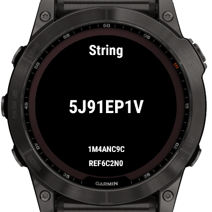
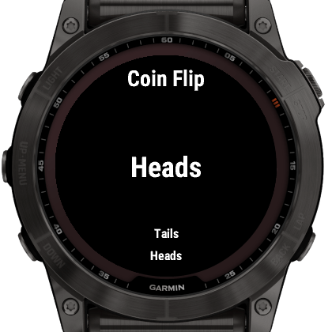
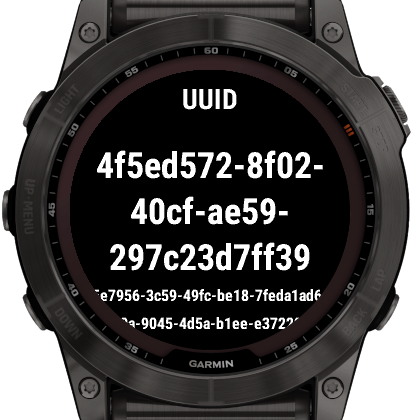
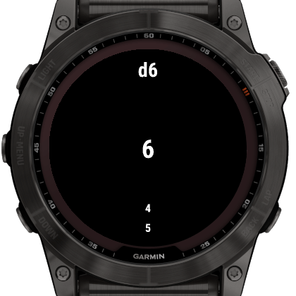

# Lx Random

An app for creating random numbers and values for Garmin devices.

## Features

- Can generate:
  - Coin flips
  - Common dice: d4, d6, d8, d10, d12, d20, d100
  - Numbers in a range
  - Strings
  - Version 4 UUIDS

## How to Use

Select which type of value to generate from the menu, then tap the screen or
press the START button to generate a value.

## Settings

Settings can only be adjusted on the device.

- Range Minimum and Maximum
  - Sets the inclusive range of values the "Range" generator can create.
- String Length
  - Sets the number of characters generated strings will include
- String Include Categories
  - Sets which kinds of characters will be included in generated strings.

Developer Documentation

## Preparing a release

To perform a release:

- Create an entry in [CHANGELOG.md](CHANGELOG.md) under the next version
- Update README.md with features / screenshots
- Update the version number for `AppVersion` in
  [resources/strings.xml](resources/strings.xml).
- Commit with `Version x.x.x`
- Tag that commit as `vx.x.x`

## Creating screenshots

- Use the latest Fenix X watch in the simulator
- Screenshot with an external program (to capture the border as well)
- Using GIMP:
  1. Create a selection around the 280x280 pixels of the screen
  2. Grow the selection by 70 pixels
  3. Using the Fuzzy Select Tool
    - Antialiasing enabled
    - Feather edges set to `2.0`
    - Threshold set to `50`
  4. Remove the white exterior

## Screenshots

